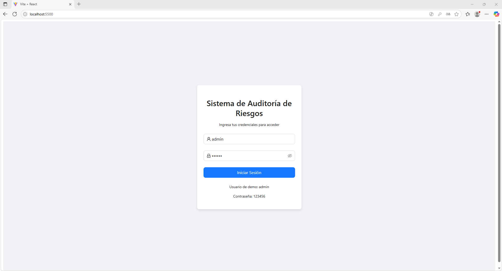
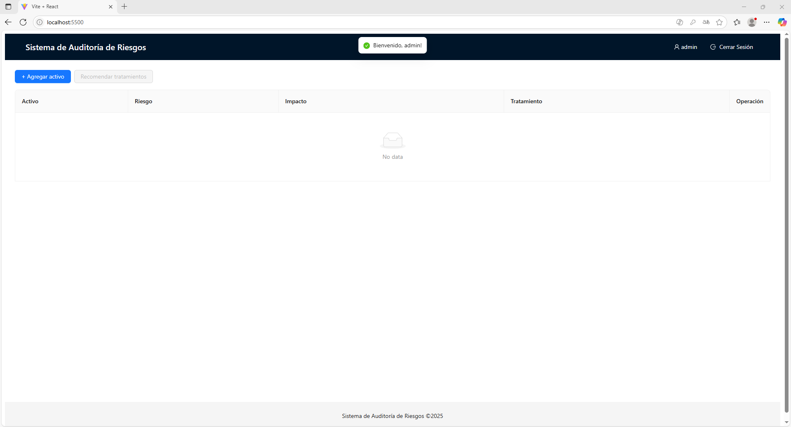
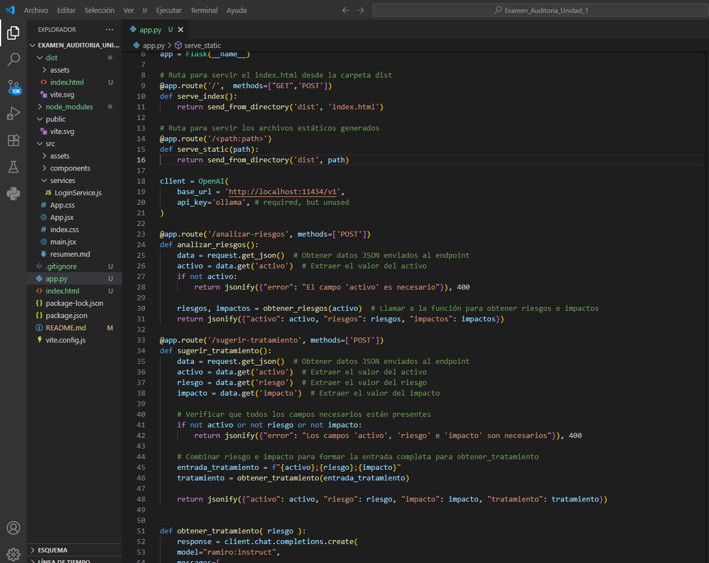
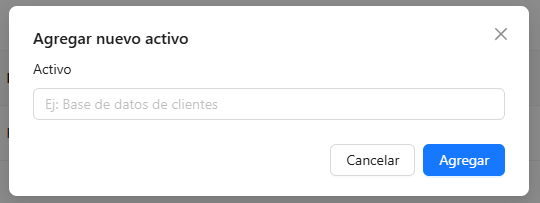
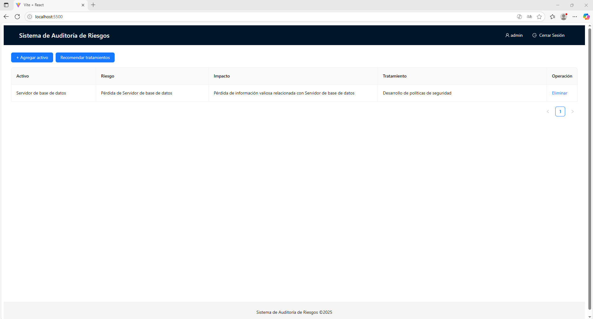
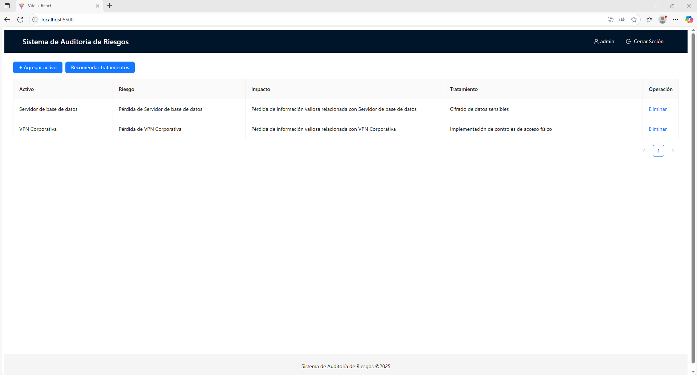
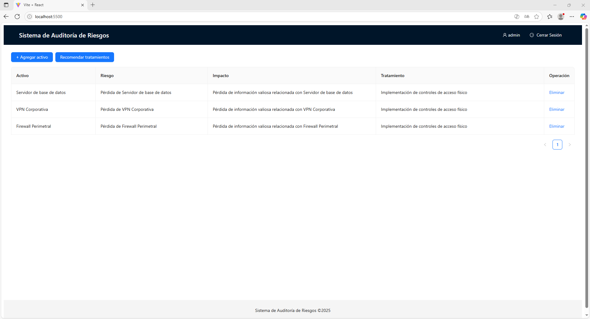
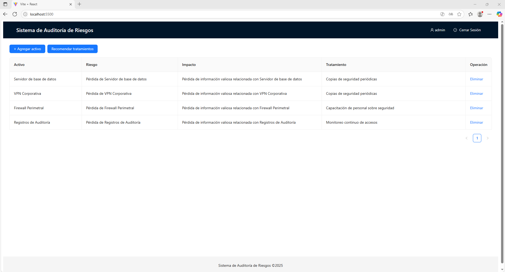
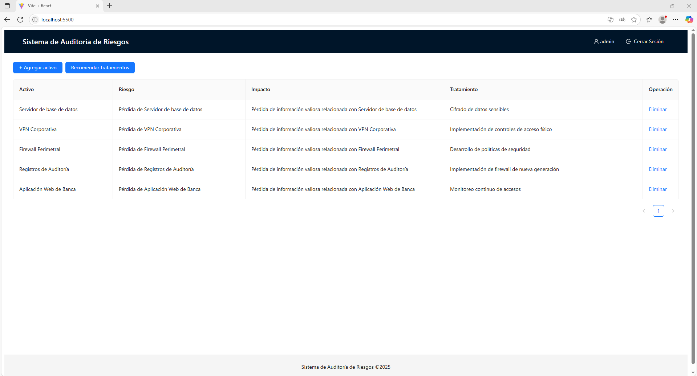

# Informe de Auditoría de Sistemas - Examen de la Unidad I

**Nombres y apellidos:** Leandro Hurtado Ortiz  
**Fecha:** 10/09/2025  
**URL GitHub:** [https://github.com/leandrodho/Examen_Auditoria_Unidad_1](https://github.com/leandrodho/Examen_Auditoria_Unidad_1)

---

## 1. Proyecto de Auditoría de Riesgos

### Login

**Evidencia:**  

**Descripción:**  
El inicio de sesión ficticio se implementó mediante un componente en React (`Login.jsx`) y un servicio de autenticación (`LoginService.js`) que valida credenciales predefinidas (usuario: **admin**, contraseña: **123456**).  
Al iniciar sesión correctamente, se guarda un token simulado en `localStorage` para mantener la sesión activa y se muestra la interfaz principal del sistema. Este mecanismo no utiliza base de datos real, sino que emula la autenticación únicamente con datos en memoria del navegador.

---

### Motor de Inteligencia Artificial

**Evidencia:**  

**Descripción:**  
El motor de IA se implementó en el backend (`app.py`) usando Flask. Se crearon los endpoints **/analizar-riesgos** y **/sugerir-tratamiento**, que reciben datos del activo y devuelven riesgos, impactos y posibles tratamientos.  
La lógica utiliza un modelo local de lenguaje y expresiones regulares para procesar la respuesta y enviarla en formato JSON al frontend.

---

## 2. Hallazgos

### Activo 1: Servidor de base de datos

**Evidencia:**  

**Condición:**  
Se identificó el riesgo de pérdida del servidor de base de datos, lo que implica la posibilidad de perder información valiosa relacionada con las operaciones críticas del banco.  

**Recomendación:**  
Aplicar políticas de seguridad específicas para bases de datos, incluyendo cifrado en reposo y en tránsito, autenticación multifactor para administradores, controles de acceso basados en roles, así como respaldos automáticos y monitoreo continuo de logs.  

**Riesgo:** Alta  

---

### Activo 2: VPN Corporativa

**Evidencia:**  

**Condición:**  
Se identificó riesgo de pérdida de la VPN corporativa, lo que podría ocasionar la interrupción del acceso remoto seguro y la exposición de información sensible en tránsito.  

**Recomendación:**  
Fortalecer la seguridad de la VPN implementando cifrado robusto (IKEv2/IPsec o WireGuard), habilitar autenticación multifactor, limitar accesos por roles y registrar todas las conexiones para detectar anomalías.  

**Riesgo:** Alta  

---

### Activo 3: Firewall Perimetral

**Evidencia:**  

**Condición:**  
Se identificó riesgo de pérdida o fallo del firewall perimetral, lo que expone la red corporativa a posibles accesos no autorizados y tráfico malicioso.  

**Recomendación:**  
Implementar un firewall perimetral de nueva generación, reforzar las políticas de filtrado, aplicar controles de acceso físico y lógico, y monitorear continuamente los eventos de red.  

**Riesgo:** Media  

---

### Activo 4: Registros de Auditoría

**Evidencia:**  

**Condición:**  
Se identificó riesgo de pérdida de registros de auditoría, lo que compromete la trazabilidad de eventos de seguridad y dificulta la detección de incidentes o accesos indebidos.  

**Recomendación:**  
Asegurar que los registros se almacenen de forma centralizada, con acceso restringido y en sistemas inmutables; habilitar copias de seguridad automáticas y aplicar monitoreo continuo de accesos a los logs.  

**Riesgo:** Medio  

---

### Activo 5: Aplicación Web de Banca

**Evidencia:**  

**Condición:**  
Se identificó riesgo de pérdida de la aplicación web de banca, lo que podría ocasionar la indisponibilidad del servicio para los clientes y la exposición de datos financieros sensibles.  

**Recomendación:**  
Implementar desarrollo seguro siguiendo los lineamientos de OWASP, habilitar pruebas de penetración periódicas, monitorear accesos en tiempo real y aplicar medidas de alta disponibilidad (balanceadores de carga, redundancia).  

**Riesgo:** Alta  

---

## Anexo 1: Activos de información

*(Se conserva la lista completa de los activos del examen como referencia)*

---

## Anexo 1: Activos de información

| #  | Activo                               | Tipo        |
|----|--------------------------------------|-------------|
| 1  | Servidor de base de datos            | Base de Datos |
| 2  | API Transacciones                    | Servicio Web |
| 3  | Aplicación Web de Banca              | Aplicación   |
| 4  | Servidor de Correo                   | Infraestructura |
| 5  | Firewall Perimetral                  | Seguridad    |
| 6  | Autenticación MFA                    | Seguridad    |
| 7  | Registros de Auditoría               | Información  |
| 8  | Backup en NAS                        | Almacenamiento |
| 9  | Servidor DNS Interno                 | Red          |
| 10 | Plataforma de Pagos Móviles          | Aplicación   |
| 11 | VPN Corporativa                      | Infraestructura |
| 12 | Red de Cajeros Automáticos           | Infraestructura |
| 13 | Servidor FTP                         | Red          |
| 14 | CRM Bancario                         | Aplicación   |
| 15 | ERP Financiero                       | Aplicación   |
| 16 | Base de Datos Clientes               | Información  |
| 17 | Logs de Seguridad                    | Información  |
| 18 | Servidor Web Apache                  | Infraestructura |
| 19 | Consola de Gestión de Incidentes     | Seguridad    |
| 20 | Políticas de Seguridad Documentadas  | Documentación |
| 21 | Módulo KYC (Know Your Customer)      | Aplicación   |
| 22 | Contraseñas de Usuarios              | Información  |
| 23 | Dispositivo HSM                      | Seguridad    |
| 24 | Certificados Digitales SSL           | Seguridad    |
| 25 | Panel de Administración de Usuarios  | Aplicación   |
| 26 | Red Wi-Fi Interna                    | Red          |
| 27 | Sistema de Control de Acceso Físico  | Infraestructura |
| 28 | Sistema de Video Vigilancia          | Infraestructura |
| 29 | Bot de Atención al Cliente           | Servicio Web |
| 30 | Código Fuente del Core Bancario      | Información  |
| 31 | Tabla de Usuarios y Roles            | Información  |
| 32 | Documentación Técnica                | Documentación |
| 33 | Manuales de Usuario                  | Documentación |
| 34 | Script de Backups Automáticos        | Seguridad    |
| 35 | Datos de Transacciones Diarias       | Información  |
| 36 | Herramienta SIEM                     | Seguridad    |
| 37 | Switches y Routers                   | Red          |
| 38 | Plan de Recuperación ante Desastres  | Documentación |
| 39 | Contratos Digitales                  | Información Legal |
| 40 | Archivos de Configuración de Servidores | Información  |
| 41 | Infraestructura en la Nube           | Infraestructura |
| 42 | Correo Electrónico Ejecutivo         | Información  |
| 43 | Panel de Supervisión Financiera      | Aplicación   |
| 44 | App Móvil para Clientes              | Aplicación   |
| 45 | Token de Acceso a APIs               | Seguridad    |
| 46 | Base de Datos Histórica              | Información  |
| 47 | Entorno de Desarrollo                | Infraestructura |
| 48 | Sistema de Alertas de Seguridad      | Seguridad    |
| 49 | Configuración del Cortafuegos        | Seguridad    |
| 50 | Redundancia de Servidores            | Infraestructura |

---

## Anexo 2: Rúbrica de Evaluación

| Criterio                             | 0 pts                                  | 5 pts                             | Puntaje Máximo |
|--------------------------------------|---------------------------------------|-----------------------------------|----------------|
| **Login**                            | No presenta evidencia o está incorrecto | Login ficticio completo, funcional y con evidencia clara | 5              |
| **IA**                               | No presenta IA o está incorrecta      | IA implementada, funcionando y con evidencia clara | 5              |
| **Evaluación de 5 Activos**          | Menos de 5 activos evaluados o sin hallazgos válidos | 5 activos evaluados con hallazgos claros y evidencias | 5              |
| **Informe claro y completo**        | Informe ausente, incompleto o poco entendible | Informe bien estructurado y completo según lo requerido | 5              |
| **Total**                            |                                       |                                   | 20             |

---
